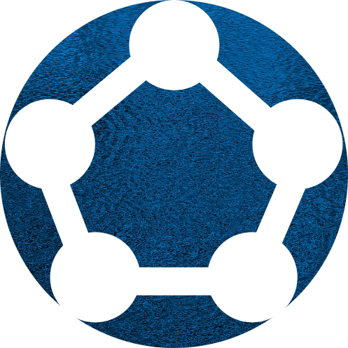

<div align="center">


<link rel="preconnect" href="https://fonts.googleapis.com">
<link rel="preconnect" href="https://fonts.gstatic.com" crossorigin>
<link href="https://fonts.googleapis.com/css2?family=Black+Ops+One&display=swap" rel="stylesheet">
<span style="font-family: 'Black Ops One'; font-size: 40px;" >Dijkstra-Visualizer </span>
<a href="https://algo-visualizer-f76e9.web.app/" style="font-size: 25px">[Visit]</a>
</div>

---

## Overview

This project is about visualization of Dijkstra algorithm. This is achieved by visual representation of vertices and edges of the graph at different points of time during the execution of algorithm. Dijkstra-Visualizer is developed using **ReactJS** and **MaterialUI**.

<br />

## Goal

Most people face difficulty when they start learning graph theory and related algorithms and this is mainly because of the fact that they do not get a feel of how exactly the algorithm is working. So, the major goal of this project is to help them as people have natural tendency to learn by seeing and interacting. We want to achieve this goal collaboratively, so feel free to contribute.

<br />

## Setting up the project locally

This project uses [React](https://reactjs.org/) and [MaterialUI v4](https://v4.mui.com/).
The package manager is [`yarn`](https://classic.yarnpkg.com/lang/en/docs/install/#windows-stable). We recommend that you install it through `npm`. To install `npm`, install [node.js](https://nodejs.org/en/download/).

1. Fork this repository
2. Clone your fork using

```posh
git clone https://github.com/<YOUR_GITHUB_HANDLE>/Dijkstra-visualizer
```

Make sure to replace <YOUR_GITHUB_HANDLE> with your github handle.

3. Move into the new `Dijkstra-visualizer` directory using

```posh
cd Dijkstra-visualizer
```

4. Install the dependencies using

```posh
yarn
```

5. To start the development server, use

```posh
yarn start
```

6. To contribute, create a NEW branch (ussing the command given below) and add your code then

```posh
git checkout -b my-new-branch
```

<br />

## Contents

The current version of this project can be divided into 2 major parts-

- **SideBar and Header** : This conatins the tools (user interface) using which user can create, interact and visualize different graph algorithms.

- **Graph Components** : This contains code for storing, modifying the graph data (i.e. adjacency list, directed/undirected edges, edge weights, etc).

</br>

## Current Features

**[✔]** Add, move and delete nodes and edges

**[✔]** Directed/Undirected edges

**[✔]** Unweighted/Weighted edges

**[✔]** Visited nodes/edges animations

**[✔]** View Adjacancy List representation for a graph

**[✔]** Set visualization speed
